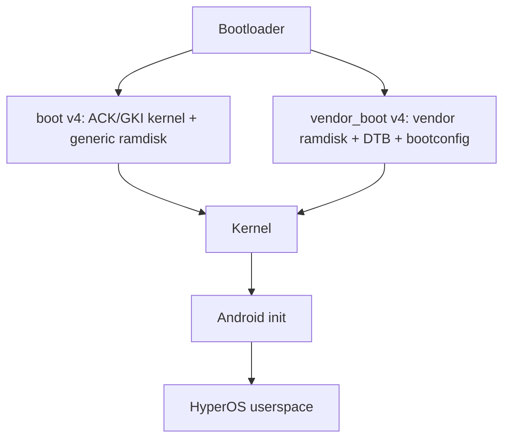
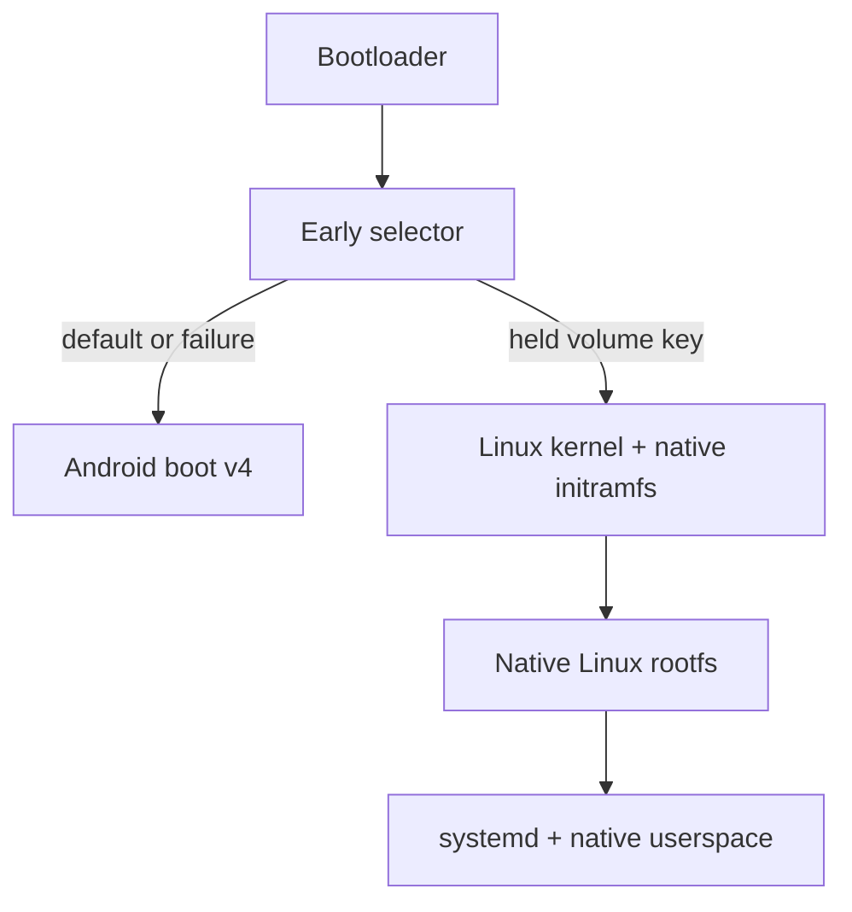

# Boot architecture

## Current Android path

The audited generic ramdisk currently inserts a KernelSU LKM wrapper before
Android init. That is a property of the captured system, not a design to carry
forward. M1 builds only a clean GKI kernel payload and does not repack or boot an
image.

## Target native-Linux path

The native path must not depend on Android init, vold, KeyMint, Termux,
SurfaceFlinger, a chroot, or an Android container. Android remains the default
and failure fallback. The selector is deferred until the Android baseline and
native initramfs have each booted independently.

## Shared platform boundary

One source-controlled platform project will eventually produce two kernel
configurations/packaging paths while sharing reviewed common patches. Stock
DTB/vendor modules/firmware may be reused locally during bring-up, but
proprietary inputs stay outside Git and outside Actions artifacts.

M0/M1 stops at a generic ACK/GKI artifact. It does not claim device bootability:
the Xiaomi donor kernel/device tree are references only until patches are
reviewed and ported one subsystem at a time.
